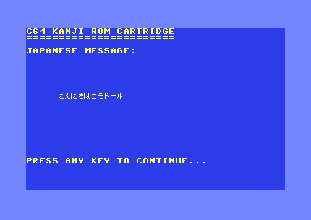
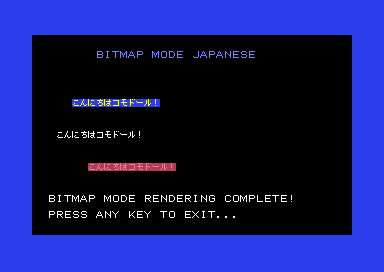
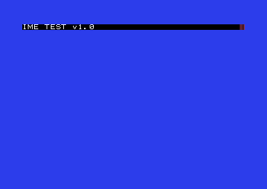
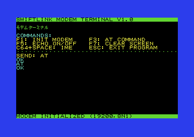

# C64 Japanese Project

| [English](README-en.md) | [日本語](README.md) |
|---------------------------|------------------------|

A project to enable Japanese text display and Kana-Kanji conversion on the Commodore 64.

## Overview

This project provides a complete Japanese language environment for the Commodore 64 (C64) through a ROM cartridge and library set. The goal is to "easily display and input Japanese text by inserting a Kanji ROM cartridge."

### System Components

#### ROM Cartridge Contents
MagicDesk format cartridge (up to 1MB) containing:
- **Japanese Font Data**: 8x8 pixel Misaki fonts for JIS X 0208 full-width and JIS X 0201 half-width characters
- **Kana-Kanji Dictionary**: Binary version of SKK format dictionary (supporting both okurinashi and okuriari)
- **String Resources**: Fixed string data for games and applications

#### Prog8 Libraries
Libraries to utilize cartridge data:
- **jtxt.p8**: Japanese display library (supports both text mode and bitmap mode)
- **ime.p8**: Kana-Kanji conversion library (romanized input, candidate selection)

General-purpose libraries:
- **swiftlink.p8**: SwiftLink RS-232 communication library (multiple baud rates, hardware flow control)

### Key Features

- **Japanese Display**: Display Kanji, Hiragana, and Katakana using 8x8 pixel bitmap fonts
- **Kana-Kanji Conversion**: Convert romanized input to Japanese with candidate selection
- **Shift-JIS Support**: Handle text data using standard character encoding
- **High-Speed Access**: Fast character rendering and dictionary search via ROM placement
- **Memory-Efficient Design**: Operates within the limited RAM of 8-bit machines

## Requirements

### Build Tools
- Python 3.x
- [Prog8 Compiler](https://github.com/irmen/prog8) v11.4.1+ (includes 64tass assembler)
- GNU Make
- curl (for font downloading)
- unzip (for font extraction)

### C Language Version (Optional)
- [llvm-mos](https://github.com/llvm-mos/llvm-mos) - C/C++ compiler (for llvm-mos QE editor)
- [Oscar64](https://github.com/drmortalwombat/oscar64) - C compiler (for Oscar64 version)

### Runtime Environment
- [VICE](https://vice-emu.sourceforge.io/) emulator (recommended: x64sc)
- Or real Commodore 64 + MagicDesk-compatible cartridge (details below)

## Screenshots

### Text Mode Display


### Bitmap Mode Display


### Kana-Kanji Conversion (IME)


### Modem Communication (SwiftLink)


## Using Pre-built Releases

To quickly try with pre-built binaries:

### 1. Download Release Files
Download the latest version from the [Releases](https://github.com/h-o-soft/c64jp/releases) page:
- `c64jpkanji.crt` - ROM cartridge file
- `c64jp_programs.d64` - Sample programs disk image

### 2. Running on Emulator
```bash
# For VICE emulator
x64sc -cartcrt c64jpkanji.crt -8 c64jp_programs.d64

# After cartridge is loaded, mount D64 and select program
LOAD"$",8
LIST

# Load and run desired program
LOAD"HELLO",8,1
RUN
```

### 3. Using on Real Hardware
1. **Prepare Cartridge**: Write CRT file to compatible flash cartridge (EasyFlash3, Ultimate 64, etc.)
2. **Transfer Disk Image**: Mount D64 file via SD2IEC, Ultimate, or similar
3. **Select Program**: Use `LOAD"$",8` to view directory
4. **Run Programs**: Load with `LOAD"program_name",8,1` and `RUN`

### Sample Programs
- `HELLO` - Basic Japanese display demo
- `HELLO BITMAP` - Bitmap mode display
- `IME TEST` - Kana-Kanji conversion demo
- `MODEM TEST` - SwiftLink communication test

## Quick Start (Build from Source)

### 1. Clone Repository
```bash
git clone https://github.com/h-o-soft/c64jp.git
cd c64jp
```

### 2. Basic Build and Run
```bash
# Build and run default program (hello.p8)
make run

# Run Japanese IME test program
make TARGET=ime_test run

# Run with string resources
make TARGET=hello_resource run-strings
```

## Makefile Targets

### Basic Targets
| Target | Description |
|---------|-------------|
| `make` | Build default program (hello.p8) |
| `make run` | Build and run (using basic cartridge) |
| `make run-strings` | Run with string resource cartridge |
| `make run-no-crt` | Run without cartridge |
| `make clean` | Delete build artifacts |
| `make clean-all` | Delete all generated files including fonts |

### Cartridge Creation
| Target | Description |
|---------|-------------|
| `make dict` | Update dictionary and create CRT file |
| `make crt` | Create basic CRT file only |
| `make fonts` | Create font files only |

### Special Run Modes
| Target | Description |
|---------|-------------|
| `make run-modem` | Run with modem emulation settings |
| `make ime` | Run IME test (alias for `make TARGET=ime_test run`) |
| `make stateful` | Run string resource test |

### Oscar64 Version (C Language)
| Target | Description |
|---------|-------------|
| `make oscar-build` | Build hello sample with Oscar64 |
| `make oscar-hello` | Build and run hello sample |
| `make oscar-qe-build` | Build QE editor with Oscar64 |
| `make oscar-qe-run` | Build and run QE editor |
| `make oscar-crt-build` | Build EasyFlash CRT |
| `make oscar-crt-run` | Build and run EasyFlash CRT |
| `make oscar-clean` | Remove Oscar64 build artifacts |

### Terminal (Ultimate II+ Network)
The terminal application is built separately in `c/oscar64_term/`. See [c/oscar64_term/README.md](c/oscar64_term/README.md) for details.

### Configurable Variables
```bash
# Specify program to build
make TARGET=hello run

# Specify dictionary file
make DICT_FILE=mydict.txt dict

# Change emulator
make EMU_COMMAND=ccs64 EMU_CARTRIDGE_OPT=-cart run

# Specify additional options
make EMU_EXTRA_OPTS='-warp -autostartprgmode 1' run
```

## Project Structure

```
c64-kanji-rom/
├── Makefile                # Main build file
├── prog8/                  # Prog8 source code
│   └── src/
│       ├── jtxt.p8        # Japanese display library
│       ├── ime.p8         # Kana-Kanji conversion library
│       ├── swiftlink.p8   # SwiftLink communication library
│       └── *.p8           # Various test programs
├── c/                      # C language version
│   ├── oscar64_lib/       # Oscar64 shared library (jtxt, IME, c64u network)
│   ├── oscar64/           # Oscar64 hello sample
│   ├── oscar64_qe/        # Oscar64 QE editor
│   ├── oscar64_crt/       # Oscar64 EasyFlash CRT version
│   ├── oscar64_term/      # Terminal (Ultimate II+ network)
│   └── src/               # llvm-mos version source
├── fontconv/               # Font conversion tool (Misaki font → binary)
│   ├── mkfont.py          # Font conversion script
│   └── Makefile           # Font build file
├── dicconv/                # Dictionary conversion tool (SKK dictionary → binary)
│   └── dicconv.py         # SKK dictionary conversion script
├── stringresources/        # String resource management
│   └── convert_string_resources.py
├── createcrt/              # CRT file creation
│   └── create_crt.py      # MagicDesk CRT creation script
└── crt/                    # Generated CRT files
```

## Library Details

### Japanese Display Library (jtxt.p8)

Handles Japanese character screen display. Uses font data in ROM cartridge for high-speed rendering.

#### Main Functions
- `init(start_char, char_count, mode)` - Initialize library
- `putc(char)` / `bputc(char)` - Output single character (Shift-JIS support)
- `puts(str)` / `bputs(str)` - Output string
- `locate(x, y)` / `blocate(x, y)` - Set cursor position
- `cls()` / `bcls()` - Clear screen
- `set_color(fg)` / `bcolor(fg, bg)` - Set colors

### Kana-Kanji Conversion Library (ime.p8)

Handles conversion from romanized input to Japanese. Uses dictionary data in ROM cartridge.

#### Main Features
- Romanized → Hiragana conversion
- Hiragana → Kanji conversion (dictionary lookup)
- Conversion candidate display and selection
- Support for both okurinashi and okuriari

### SwiftLink Communication Library (swiftlink.p8)

Library for RS-232 serial communication using SwiftLink (unrelated to Japanese functionality).

#### Main Features
- Initialization with various settings
- Data transmission and reception
- Data loss prevention via hardware flow control

## Build Process

1. **Font Creation**: Generate 8x8 bitmap data from Misaki font PNG
2. **Dictionary Conversion**: Convert SKK format text dictionary to binary
3. **String Resource Creation**: Generate indexed binary from text/CSV files (optional)
4. **CRT Creation**: Generate MagicDesk format CRT file containing fonts, dictionary, and string resources
5. **Program Compilation**: Compile Prog8 source code (using jtxt.p8, ime.p8) to PRG files
6. **Execution**: Run PRG files in VICE emulator with CRT loaded

## Real Hardware Operation

### Cartridge File Format
The cartridge files created by this project are **MagicDesk format** CRT files. For real hardware operation, CRT files must be transferred to real hardware using one of the following methods:

- **EasyFlash3**: Direct CRT file writing capability
- **Ultimate 64/1541 Ultimate**: Direct CRT file mounting from SD card
- **Other Flash Cartridges**: Use MagicDesk-compatible ones

### I/O Address Conflicts
MagicDesk format uses **$DE00** in the I/O area, so be careful of conflicts with other devices using the same address range:

#### Swiftlink Compatibility
- This project's `swiftlink.p8` uses **$DF00** as the base address
- **REU Usage Note**: REU uses $DF00〜$DF0A, so when using REU and Swiftlink together, Swiftlink must be moved to $DF80
- Recommended Ultimate 64 settings with REU:
  - Cartridge: $DE00 (default)
  - REU: $DF00〜$DF0A (used by REU)
  - Swiftlink: $DF80 (to avoid conflict)

#### Address Change Method
To change Swiftlink base address:

```prog8
// Change the following in swiftlink.p8
const uword SWIFTLINK_BASE = $DF80  // Change from $DF00 to $DF80
```

Rebuild after changes:
```bash
make clean
make TARGET=modem_test run
```

### Hardware Compatibility

| Hardware | Support | Notes |
|----------|---------|-------|
| EasyFlash3 | ✅ Supported | Direct CRT writing |
| Ultimate 64 | ✅ Supported | SD card mounting |
| 1541 Ultimate-II+ | ✅ Supported | SD card mounting |
| Kung Fu Flash | ✅ Supported | SD card mounting |
| Final Cartridge III | ❌ Not supported | No MagicDesk support |

## Troubleshooting

### Font Files Not Found
```bash
make fonts  # Create font files
```

### Dictionary Files Not Found
```bash
make dict   # Create dictionary and CRT files
```

### VICE Won't Start
```bash
# Check emulator path
which x64sc

# Use different emulator
make EMU_COMMAND=/path/to/emulator run
```

### Build Errors
```bash
# Clean build
make clean-all
make run
```

### Cartridge Not Recognized on Real Hardware
- Verify cartridge file is correctly created in MagicDesk format
- Ensure flash cartridge supports MagicDesk format
- Power cycle the machine and reinsert cartridge

### Swiftlink Not Working
- Check for I/O address conflicts (see "I/O Address Conflicts" above)
- Verify hardware jumper settings
- Check modem cable connections

## License

### Project Code
MIT License - See [LICENSE](LICENSE) file for details.

### Fonts Used
- **Misaki Font**: Created by Namu Kadoma
  - License: [MIT License](https://littlelimit.net/misaki.htm)
  - Misaki font is included in ROM cartridge

### Dictionary Data
- Please follow the license of each dictionary file
- This project uses dictionaries based on naist-jdic SKK dictionary.

## Contributing

Pull requests are welcome. For major changes, please open an issue first to discuss the proposed changes.

## Related Links

- [Prog8 Documentation](https://prog8.readthedocs.io/)
- [VICE Emulator](https://vice-emu.sourceforge.io/)
- [Misaki Font](https://littlelimit.net/misaki.htm)
- [SKK Dictionary](https://skk-dev.github.io/dict/)

## Author

Hiroshi OGINO / H.O SOFT Inc.

## TODO / Future Plans

### Library Improvements
- **Library Optimization**: Clean up complex and redundant AI-generated code to improve memory usage and speed
- **Assembler Call Support**: Make libraries directly callable from assembler
- **Library Deployment from ROM**: Store jtxt and ime in cartridge ROM and deploy to RAM at $A000-$BFFF etc. on startup to free up application memory (needs consideration)

### Kana-Kanji Conversion Enhancement
- **Dictionary Improvement**: Enhance dictionary data for more accurate conversion (especially adding proper nouns)

### Application Development
- **Communication App**: Simple support for escape sequences

## Acknowledgments

- Thanks to Namu Kadoma, author of Misaki font
- Thanks to Irmen de Jong, author of Prog8
- Thanks to the developers of 64tass assembler
- Thanks to the Commodore 64 community