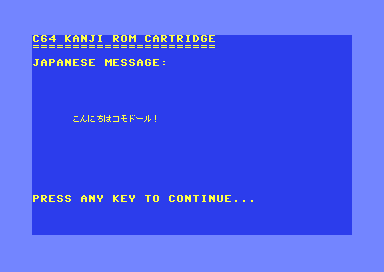
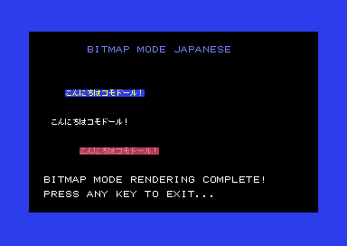
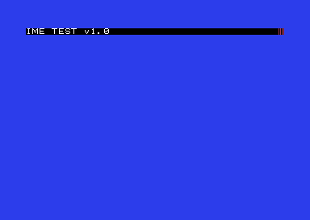
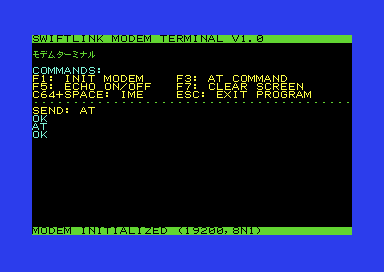

# C64 日本語プロジェクト

| [English](README-en.md) | [日本語](README.md) |
|---------------------------|------------------------|

Commodore 64で日本語表示及び日本語かな漢字変換を実現するためのプロジェクトです。

## 概要

本プロジェクトは、Commodore 64（C64）で完全な日本語環境を提供するROMカートリッジとライブラリのセットです。「漢字ROMカートリッジを挿しておくと日本語の表示と入力が簡単に出来る」ことを目指しています。

### システム構成

#### ROMカートリッジの内容
MagicDesk形式のカートリッジ（最大1MB）に以下のデータを格納：
- **日本語フォントデータ**: 美咲フォント（8x8ピクセル）によるJIS X 0208全角文字とJIS X 0201半角文字
- **かな漢字変換辞書**: SKK形式辞書のバイナリ版（送りなし・送りあり対応）
- **文字列リソース**: ゲームやアプリケーション用の固定文字列データ

#### Prog8ライブラリ
カートリッジのデータを活用するためのライブラリ：
- **jtxt.p8**: 日本語表示ライブラリ（テキストモード/ビットマップモード両対応）
- **ime.p8**: かな漢字変換ライブラリ（ローマ字入力、候補選択）

汎用的なライブラリ：
- **swiftlink.p8**: SwiftLink RS-232通信ライブラリ(各種ボーレート対応、ハードウェアフロー制御)

### 主な機能

- **日本語表示**: 漢字・ひらがな・カタカナを8x8ピクセルのビットマップフォントで表示
- **かな漢字変換**: ローマ字入力から日本語への変換、複数候補からの選択
- **Shift-JIS対応**: 標準的な文字コードでテキストデータを扱える
- **高速アクセス**: ROM配置により高速な文字描画と辞書検索を実現
- **省メモリ設計**: 8ビット機の限られたRAMでも動作

## 必要な環境

### ビルドツール
- Python 3.x
- [Prog8コンパイラ](https://github.com/irmen/prog8) v11.4.1以降（64tassアセンブラを含む）
- GNU Make
- curl（フォントダウンロード用）
- unzip（フォント展開用）

### 実行環境
- [VICE](https://vice-emu.sourceforge.io/)エミュレータ（推奨: x64sc）
- または実機のCommodore 64 + MagicDesk対応カートリッジ（詳細は後述）

## スクリーンショット

### テキストモード表示


### ビットマップモード表示


### かな漢字変換（IME）


### モデム通信（SwiftLink）


## クイックスタート

### 1. リポジトリのクローン
```bash
git clone https://github.com/h-o-soft/c64jp.git
cd c64jp
```

### 2. 基本的なビルドと実行
```bash
# デフォルトプログラム（hello.p8）のビルドと実行
make run

# 日本語IMEテストプログラムの実行
make TARGET=ime_test run

# 文字列リソース付きで実行
make TARGET=hello_resource run-strings
```

## Makefileターゲット

### 基本ターゲット
| ターゲット | 説明 |
|------------|------|
| `make` | デフォルトプログラム（hello.p8）をビルド |
| `make run` | ビルドして実行（基本カートリッジ使用） |
| `make run-strings` | 文字列リソース付きカートリッジで実行 |
| `make run-no-crt` | カートリッジなしで実行 |
| `make clean` | ビルド成果物を削除 |
| `make clean-all` | フォントファイルを含む全ての生成ファイルを削除 |

### カートリッジ作成
| ターゲット | 説明 |
|------------|------|
| `make dict` | 辞書を更新してCRTファイルを作成 |
| `make crt` | 基本CRTファイルのみ作成 |
| `make fonts` | フォントファイルのみ作成 |

### 特殊実行モード
| ターゲット | 説明 |
|------------|------|
| `make run-modem` | モデムエミュレーション設定で実行 |
| `make ime` | IMEテストを実行（`make TARGET=ime_test run`のエイリアス） |
| `make stateful` | 文字列リソーステストを実行 |

### 設定可能な変数
```bash
# ビルドするプログラムを指定
make TARGET=hello run

# 辞書ファイルを指定
make DICT_FILE=mydict.txt dict

# エミュレータを変更
make EMU_COMMAND=ccs64 EMU_CARTRIDGE_OPT=-cart run

# 追加オプションを指定
make EMU_EXTRA_OPTS='-warp -autostartprgmode 1' run
```

## プロジェクト構成

```
c64-kanji-rom/
├── Makefile                # メインビルドファイル
├── prog8/                  # Prog8ソースコード
│   └── src/
│       ├── jtxt.p8        # 日本語表示ライブラリ
│       ├── ime.p8         # かな漢字変換ライブラリ
│       ├── swiftlink.p8   # SwiftLink通信ライブラリ
│       └── *.p8           # 各種テストプログラム
├── fontconv/               # フォント変換ツール（美咲フォント→バイナリ）
│   ├── mkfont.py          # フォント変換スクリプト
│   └── Makefile           # フォントビルド用
├── dicconv/                # 辞書変換ツール（SKK辞書→バイナリ）
│   └── dicconv.py         # SKK辞書変換スクリプト
├── stringresources/        # 文字列リソース管理
│   └── convert_string_resources.py
├── createcrt/              # CRTファイル作成
│   └── create_crt.py      # MagicDesk CRT作成スクリプト
└── crt/                    # 生成されたCRTファイル
```

## ライブラリ詳細

### 日本語表示ライブラリ（jtxt.p8）

日本語文字の画面表示を担当。ROMカートリッジ内のフォントデータを使用して高速描画。

#### 主要関数
- `init(start_char, char_count, mode)` - ライブラリ初期化
- `putc(char)` / `bputc(char)` - 1文字出力（Shift-JIS対応）
- `puts(str)` / `bputs(str)` - 文字列出力
- `locate(x, y)` / `blocate(x, y)` - カーソル位置設定
- `cls()` / `bcls()` - 画面クリア
- `set_color(fg)` / `bcolor(fg, bg)` - 色設定

### かな漢字変換ライブラリ（ime.p8）

ローマ字入力から日本語への変換を担当。ROMカートリッジ内の辞書データを使用。

#### 主要機能
- ローマ字→ひらがな変換
- ひらがな→漢字変換（辞書検索）
- 変換候補の表示と選択
- 送りなし・送りあり両対応

### SwiftLink通信ライブラリ (swiftlink.p8)

日本語とは関係ないがSwiftLinkを使いRS-232シリアル通信を行うライブラリ。

#### 主要機能
- 各種設定による初期化
- データの送受信
- ハードウェアフロー制御によるデータロス防止

## ビルドの流れ

1. **フォント作成**: 美咲フォントPNGから8x8ビットマップデータを生成
2. **辞書変換**: SKK形式テキスト辞書をバイナリ形式に変換
3. **文字列リソース作成**: テキスト/CSVファイルからインデックス付きバイナリを生成（オプション）
4. **CRT作成**: フォント、辞書、文字列リソースを含むMagicDesk形式CRTファイルを生成
5. **プログラムコンパイル**: Prog8ソースコード（jtxt.p8、ime.p8使用）をPRGファイルにコンパイル
6. **実行**: VICEエミュレータでCRTをロードしてプログラムを実行

## 実機での動作

### カートリッジファイル形式
本プロジェクトで作成されるカートリッジファイルは **MagicDesk形式** のCRTファイルです。実機での動作には、以下のいずれかの方法でCRTファイルを実機に転送する必要があります：

- **EasyFlash3**: CRTファイルを直接書き込み可能
- **Ultimate 64/1541 Ultimate**: SDカードからCRTファイルを直接マウント
- **その他のフラッシュカートリッジ**: MagicDesk形式対応のものを使用

### I/Oアドレスの競合について
MagicDesk形式はI/O領域の **$DE00** を使用するため、同じアドレス範囲を使用する他の機器との競合に注意が必要です：

#### Swiftlinkとの併用
- 本プロジェクトの`swiftlink.p8`は **$DF00** をベースアドレスとして設定
- **REU使用時の注意**: REUは$DF00〜$DF0Aを使用するため、REUとSwiftlinkを併用する場合はSwiftlinkを$DF80に移動する必要があります
- Ultimate 64環境でREU併用時の推奨設定：
  - カートリッジ: $DE00（デフォルト）
  - REU: $DF00〜$DF0A（REUが使用）
  - Swiftlink: $DF80（競合回避のため）

#### アドレス変更方法
Swiftlinkのベースアドレスを変更する場合：

```prog8
// swiftlink.p8内で以下を変更
const uword SWIFTLINK_BASE = $DF80  ; $DF00から$DF80に変更
```

変更後は再ビルドが必要です：
```bash
make clean
make TARGET=modem_test run
```

### 対応ハードウェア

| ハードウェア | 対応状況 | 備考 |
|-------------|---------|------|
| EasyFlash3 | ✅ 対応 | CRT直接書き込み |
| Ultimate 64 | ✅ 対応 | SDカードマウント |
| 1541 Ultimate-II+ | ✅ 対応 | SDカードマウント |
| Kung Fu Flash | ✅ 対応 | SDカードマウント |
| Final Cartridge III | ❌ 非対応 | MagicDesk非対応 |

## トラブルシューティング

### フォントファイルが見つからない
```bash
make fonts  # フォントファイルを作成
```

### 辞書ファイルが見つからない
```bash
make dict   # 辞書とCRTファイルを作成
```

### VICEが起動しない
```bash
# エミュレータパスを確認
which x64sc

# 別のエミュレータを使用
make EMU_COMMAND=/path/to/emulator run
```

### ビルドエラーが発生する
```bash
# クリーンビルド
make clean-all
make run
```

### 実機でカートリッジが認識されない
- カートリッジファイルがMagicDesk形式で正しく作成されているか確認
- フラッシュカートリッジがMagicDesk形式に対応しているか確認
- 実機の電源を一度切ってからカートリッジを挿入し直す

### Swiftlinkが動作しない
- I/Oアドレス競合の可能性を確認（上記「I/Oアドレスの競合について」参照）
- ハードウェアジャンパー設定を確認
- モデムケーブルの接続を確認

## ライセンス

### 本プロジェクトのコード
MITライセンス

Copyright (c) 2025 H.O SOFT Inc.

Permission is hereby granted, free of charge, to any person obtaining a copy
of this software and associated documentation files (the "Software"), to deal
in the Software without restriction, including without limitation the rights
to use, copy, modify, merge, publish, distribute, sublicense, and/or sell
copies of the Software, and to permit persons to whom the Software is
furnished to do so, subject to the following conditions:

The above copyright notice and this permission notice shall be included in all
copies or substantial portions of the Software.

THE SOFTWARE IS PROVIDED "AS IS", WITHOUT WARRANTY OF ANY KIND, EXPRESS OR
IMPLIED, INCLUDING BUT NOT LIMITED TO THE WARRANTIES OF MERCHANTABILITY,
FITNESS FOR A PARTICULAR PURPOSE AND NONINFRINGEMENT. IN NO EVENT SHALL THE
AUTHORS OR COPYRIGHT HOLDERS BE LIABLE FOR ANY CLAIM, DAMAGES OR OTHER
LIABILITY, WHETHER IN AN ACTION OF CONTRACT, TORT OR OTHERWISE, ARISING FROM,
OUT OF OR IN CONNECTION WITH THE SOFTWARE OR THE USE OR OTHER DEALINGS IN THE
SOFTWARE.

### 使用しているフォント
- **美咲フォント**: 門真なむ氏作成
  - ライセンス: [MITライセンス](https://littlelimit.net/misaki.htm)
  - 美咲フォントはROMカートリッジに含まれます

### 辞書データ
- 各辞書ファイルのライセンスに従ってください
- 本プロジェクトは naist-jdic SKK dictionary をベースとした辞書を使用しています。

## 貢献

プルリクエストを歓迎します。大きな変更の場合は、まずissueを開いて変更内容について議論してください。

## 関連リンク

- [Prog8 Documentation](https://prog8.readthedocs.io/)
- [VICE Emulator](https://vice-emu.sourceforge.io/)
- [美咲フォント](https://littlelimit.net/misaki.htm)
- [SKK辞書](https://skk-dev.github.io/dict/)

## 作者

Hiroshi OGINO / H.O SOFT Inc.

## 謝辞

- 美咲フォントの作者である門真なむ氏に感謝します
- Prog8の作者Irmen de Jong氏に感謝します
- 64tassアセンブラの開発者に感謝します
- Commodore 64コミュニティの皆様に感謝します